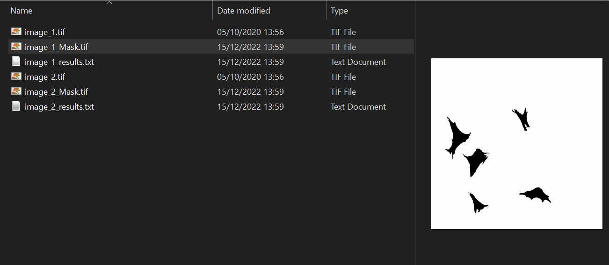

# « Btach process folder »
Fiji macro adapted and developped at the CIF 

## Release date
15/12/2022

## Author
Yannick Krempp

## Expected entry
a folder of single channel fluorescent images of cells

## Description
Simple example of processing a folder of single channel fluorescent images of cells, saving masks and results

## Related YouTube videos
- N/A

## Requirements 
- None

## Script version
0.1

## Screenshot
.
